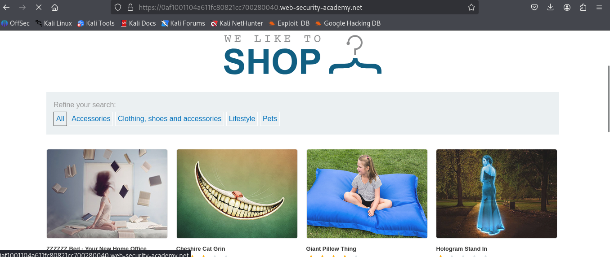
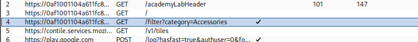
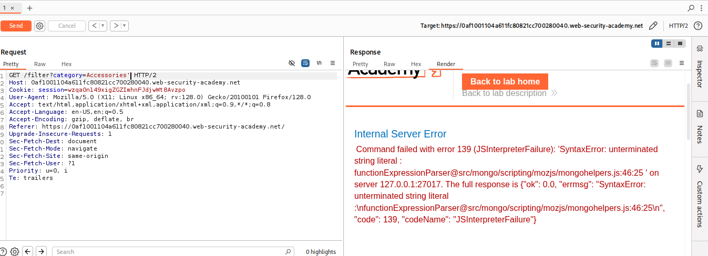
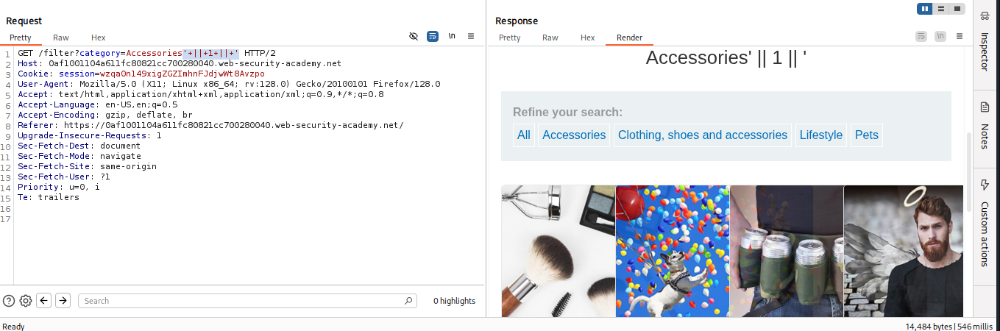

# Lab: Detecting NoSQL injection

## The product category filter for this lab is powered by a MongoDB NoSQL database. It is vulnerable to NoSQL injection. 

### Here we know the applicatio is running on mongodb as database, now I will start my Burpsuite Proxy and see the responses for different endpoints

-> Here's the webpage we have to inject NOSQL Injection,


-> Now I will Accessories and intercept the request and send it repeater


-> Now in Repeater I will try to get the error message using the parameter like:

```bash
"
'
{
}
```

I used ' and it worked


### Now as we do in SQL Injection we have to use boolean conditions to reveal the hidden products

```bash
' && 1 ==1
' && '1' == '1
' || 1 || '
```

###  I used **' || 1 || '** and worked and Solved my First No Sql Injection LAB
