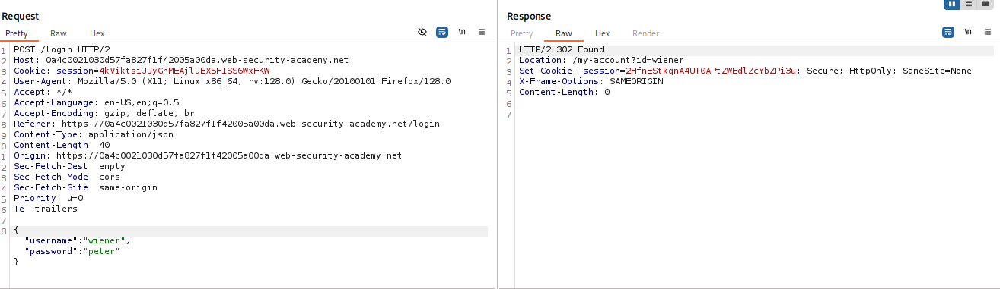
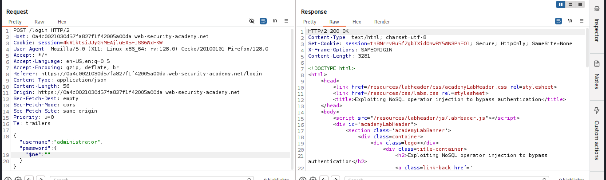
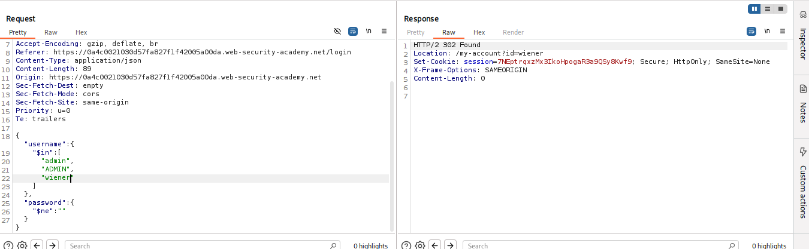
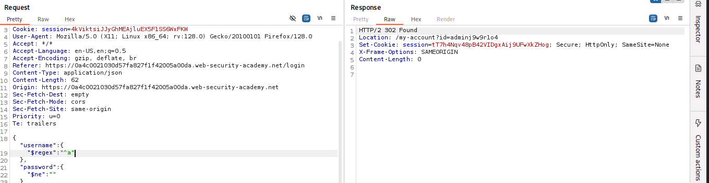
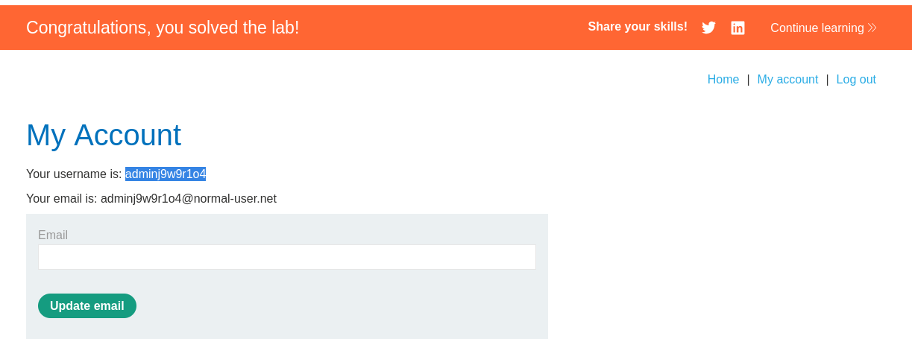

# 🎯Exploiting NoSQL operator injection to bypass authentication

### **Desciption**  The login functionality for this lab is powered by a MongoDB NoSQL database. It is vulnerable to NoSQL injection using MongoDB operators. To solve the lab, log into the application as the administrator user. You can log in to your own account using the following credentials: wiener:peter


Let's go to the login page and turn the proxy on,when I try to login with provided credentials:
> wiener:peter 

I got following response:



So here, I see that the request is taking data into a JSON Object:
```javascript

{
    "username":"wiener",
    "password":"peter"
}
```

Now we can play with the MongoDB operators like $in, $ne, $regex, etc....
Now when I try to give the wrong password for **wiener** I got **HTTP/2 200 OK** It means we can use Mongodb operators to test for the vulnearability

So I used administrator as username and kept the password field blank and got the following response


So here I got to know that the username for the admin is not administrator and to verify this I used $in operator and passed array of possible usernames and got this response:


So It again jumped to wiener and does not take admin or ADMN as usenames as they don't exist in database

Soo,Here I will use the **$regex** which is regular expression operator in MongoDB and can be used to process regular expression

So I created the following regex:
```json
{
    "username": {
        "$regex": "^a"
    },
    "password": {
        "$ne": ""
    }
}
```

> ^a means username starting with alphabet **a**

#### BAMM !!!! We got the session cokkie for the admin and its username which is **adminj9w9r1o4**

