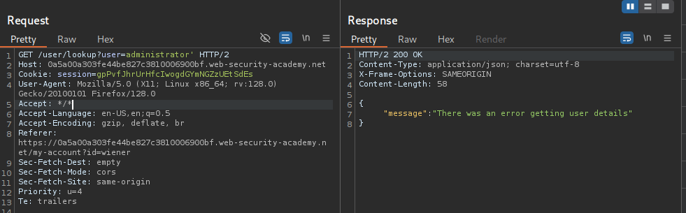

# Lab: Exploiting NoSQL injection to extract data
###  The user lookup functionality for this lab is powered by a MongoDB NoSQL database. It is vulnerable to NoSQL injection.

To solve the lab, extract the password for the administrator user, then log in to their account.

we have following credentials: 
```json
{   
    username: wiener,
    password:peter
}
```

### Detecting No SQL Injection works or not
I Started the Burpsuite proxy and intercepted the request for user administrator, I used ' payload and got the following:


